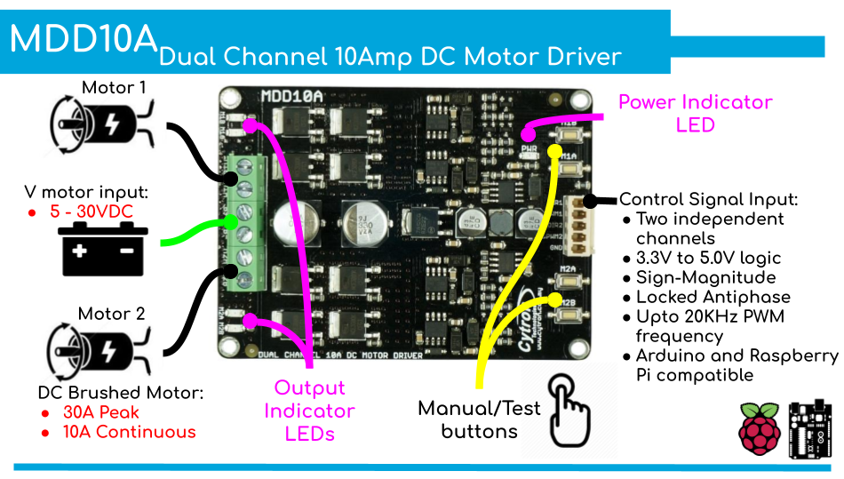

# CytronMDD10A
> MDD10A is the dual-channel version designed to drive 2 brushed DC motors with a high current of up to 10A continuously. MDD10A also supports locked-antiphase and sign-magnitude PWM signal. It uses full solid-state components that offers faster response time and eliminates the wear and tear of the mechanical relay.
It can supports Vmotor from 5V to 30VDC. With the presoldered terminals, and on-board manual/test buttons

## PWM_DIR
> The example shows how to drive a motor using PWM and DIR pins.
>
>MotorSpeed(8) pin is used to control the speed of the motor while MotorDir(9) pin is used to control the direction.

## Smoothing Filter
### Simple Exponential Filter
> Exponential smoothing is one of many window functions commonly applied to smooth data in signal processing, acting as low-pass filters to remove high-frequency noise.
>
>In the example it is used to smooth the edges of PWM signal of MotorSpeed by equation:
>> SpeedVal_filtered = smoothing_factor*SpeedVal_filtered + (1 - smoothing_factor) * SpeedVal_original
>
>It multiplies the previous value by smoothing factor and adds the new PWM value multiplied by 1-smoothing factor and keeps the balance

## Dc motor Vs Universal Motor
>Universal motor is generally used for suction in vacuum cleaners. It is a series DC-motor that is designed to operate on AC as well as on DC. These motors are used because they have high starting torque, operates at high speed, and are light weighted , easy mobility.
>
>DC motor works **only** with DC supply whereas universal motor works with **both** AC and DC.
>
>The universal motor is so named because it is a type of electric motor that can operate on AC or DC power. It is a commutated series-wound motor where the stator's field coils are connected in series with the rotor windings through a commutator. It is often referred to as an AC series motor. The universal motor is very similar to a DC series motor in construction, but is modified slightly to allow the motor to operate properly on AC power. This type of electric motor can operate well on AC because the current in both the field coils and the armature (and the resultant magnetic fields) will alternate (reverse polarity) synchronously with the supply. Hence the resulting mechanical force will occur in a consistent direction of rotation, independent of the direction of applied voltage, but determined by the commutator and polarity of the field coils.

> However, the commutator has **brushes** that wear, so they are much less often used for equipment that is in **continuous use**. In addition, partly because of the commutator, universal motors are typically very noisy, both acoustically and electromagnetically.